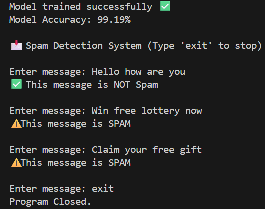

# Spam-Detection-System
Spam Message Detection using Machine Learning

This project is developed as part of my Artificial Intelligence Internship.  
It detects whether a message is **Spam** or **Not Spam (Ham)** using the Naive Bayes Machine Learning algorithm.

# Project Highlights
- Machine Learning based spam classification
- Real-time user message prediction
- Model accuracy evaluation
- Clean and beginner-friendly implementation
- Uses Natural Language Processing concepts

# Technologies Used
- Python
- Pandas
- Scikit-learn
- Naive Bayes Algorithm

# Output Screenshot

# Internship Task Submission
